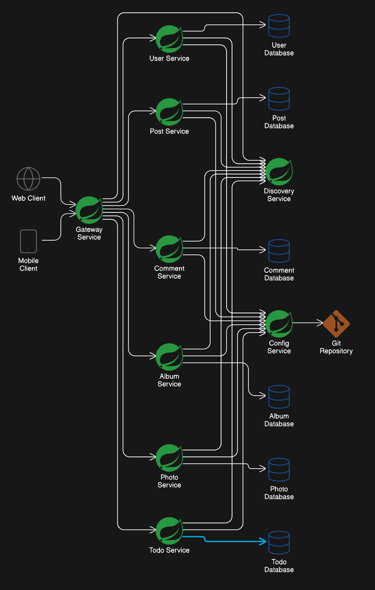

# JSON Placeholder Service

The JSON Placeholder Service is a group of Spring Boot applications designed to mimic the functionalities of the [JSONPlaceholder](https://jsonplaceholder.typicode.com/) service. This service provides RESTful APIs for handling users, posts, comments, and albums, demonstrating a microservices architecture using Spring Cloud.

## Table of Contents

- [Architecture](#architecture)
- [Microservices](#microservices)
- [Installation](#installation)
- [Usage](#usage)
- [Monitoring and Logging](#monitoring-and-logging)
- [Contributing](#contributing)

## Architecture

This project follows a microservices architecture, where each functionality is separated into individual services. The project leverages Spring Cloud for API gateway, service discovery, and configuration management.



### Technologies Used

- Spring Boot
- Spring Data JPA
- H2 Database
- Spring Cloud
- Docker
- Docker Compose
- Grafana
- Loki
- Prometheus
- Tempo

## Microservices

The JSON Placeholder Service is composed of the following microservices:

1. **Post Service**

   - Folder: [Post Service](post-service)
   - Manages posts.

2. **Comment Service**

   - Folder: [Comment Service](comment-service)
   - Manages comments.

3. **Album Service**

   - Folder: [Album Service](album-service)
   - Manages albums.

4. **Photo Service**

   - Folder: [Photo Service](photo-service)
   - Manages photos.

5. **Todo Service**

   - Folder: [Todo Service](todo-service)
   - Manages todos.

6. **User Service**
   - Folder: [User Service](user-service)
   - Manages users.

## Installation

### Prerequisites

- JDK 21
- Maven
- Docker
- Docker Compose

### Steps

1. Clone the repository:

   ```bash
   git clone https://github.com/nathsagar96/json-placeholder-service.git
   cd json-placeholder-service
   ```

2. Package each microservice:

   Navigate to each microservice folder (e.g., `post-service`, `comment-service`, etc.) and run the following command:

   ```bash
   mvn clean package
   ```

   Repeat this step for all microservices.

3. Build and start the application using Docker Compose:

   In the root directory (where `docker-compose.yml` is located), run:

   ```bash
   docker-compose up --build
   ```

   This command builds the Docker images and starts the containers for all microservices.

4. Access the application at `http://localhost:{port}`, where `{port}` is the port exposed by your API Gateway or individual services.

## Usage

### Post Endpoints

- `GET /posts`: Retrieve all posts
- `GET /posts/{id}`: Retrieve a post by ID
- `POST /posts`: Create a new post
- `PUT /posts/{id}`: Update a post by ID
- `DELETE /posts/{id}`: Delete a post by ID
- `GET /posts/user/{userId}`: Retrieve all posts by a specific user

### Comment Endpoints

- `GET /comments`: Retrieve all comments
- `GET /comments/{id}`: Retrieve a comment by ID
- `POST /comments`: Create a new comment
- `PUT /comments/{id}`: Update a comment by ID
- `DELETE /comments/{id}`: Delete a comment by ID
- `GET /comments/post/{postId}`: Retrieve all comments by a specific post

### Album Endpoints

- `GET /albums`: Retrieve all albums
- `GET /albums/{id}`: Retrieve an album by ID
- `POST /albums`: Create a new album
- `PUT /albums/{id}`: Update an album by ID
- `DELETE /albums/{id}`: Delete an album by ID
- `GET /albums/user/{userId}`: Retrieve all albums by a specific user

### Photo Endpoints

- `GET /photos`: Retrieve all photos
- `GET /photos/{id}`: Retrieve a photo by ID
- `POST /photos`: Create a new photo
- `PUT /photos/{id}`: Update a photo by ID
- `DELETE /photos/{id}`: Delete a photo by ID
- `GET /photos/album/{albumId}`: Retrieve all photos by a specific album

### Todo Endpoints

- `GET /todos`: Retrieve all todos
- `GET /todos/{id}`: Retrieve a todo by ID
- `POST /todos`: Create a new todo
- `PUT /todos/{id}`: Update a todo by ID
- `DELETE /todos/{id}`: Delete a todo by ID
- `GET /todos/user/{userId}`: Retrieve all todos by a specific user

### User Endpoints

- `GET /users`: Retrieve all users
- `GET /users/{id}`: Retrieve a user by ID
- `POST /users`: Create a new user
- `PUT /users/{id}`: Update a user by ID
- `DELETE /users/{id}`: Delete a user by ID

## Monitoring and Logging

This project integrates with several tools for monitoring and logging:

### Grafana

Grafana provides a powerful and flexible interface for visualizing metrics. To access Grafana, navigate to `http://localhost:3000`.

Grafana is configured to connect with Prometheus to fetch metrics data and visualize it.

### Prometheus

Prometheus is used for collecting and querying metrics. It scrapes metrics from your microservices and stores them for querying.

### Loki

Loki is used for log aggregation. Loki integrates with Grafana, allowing you to correlate logs and metrics.

### Tempo

Tempo is used for distributed tracing. Tempo helps in tracing the flow of requests through your microservices.

## Contributing

Contributions are welcome! Please fork the repository and submit a pull request.

1. Fork the repository
2. Create a new branch (`git checkout -b feature-branch`)
3. Commit your changes (`git commit -am 'Add new feature'`)
4. Push to the branch (`git push origin feature-branch`)
5. Create a new Pull Request
